# Few-Shot Domain Adaptation of Neural ISPs for New Smartphone Cameras

This repository focuses on the development of a new method for few-shot domain adaptation of neural image signal processing (ISP) pipelines, specifically for new mobile phone cameras. In the contemporary landscape of smartphone technology, camera quality is paramount. Traditional methods of tuning the ISP for each new device can be expensive and time-consuming. The primary challenge of neural-based ISPs is the requirement of creating a large-scale dataset each time a new smartphone is designed. 

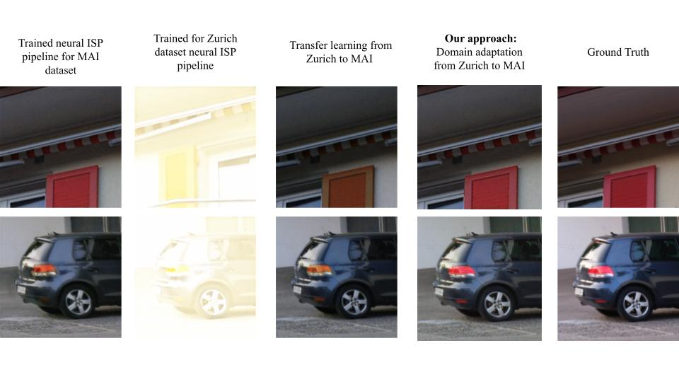

Our solution mitigates this issue by proposing a novel few-shot domain adaptation approach, where it's proven that as few as 10 labeled images from the target domain are sufficient to achieve state-of-the-art performance on real camera benchmark datasets. This technique will significantly reduce the cost and effort of neural-based ISP production for new devices, thus making it a promising solution for the modern smartphone industry. 

Contributions and discussions are highly welcome.

## Architecture
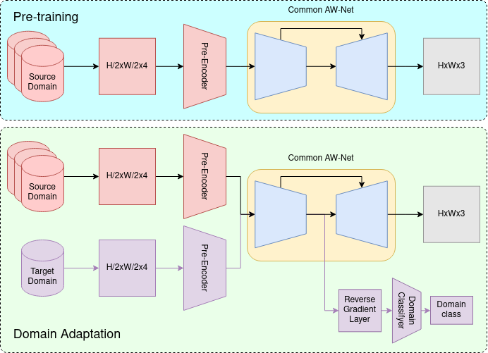

## Experiments

### Data

| Dataset             | Number of crops / images | Camera         |
| ------------------- | ------------------------ | -------------- |
| Zurich Raw2Rgb      | 46839                    | Sony IMX380    |
| MAI 2021            | 24161                    | Sony IMX586    |
| Samsung S7          |                          | Samsung S5K2L1 |
| Google Pixel (ours) |                          |                |

### Results of Domain Adaptation

- Source Domain - Zurich Raw2Rgb

| Target Dataset      | 10% of images (pasr/ssim) (~80 images) | 10 images    | 5 images     | 1 image      |
| ------------------- | -------------------------------------- | ------------ | ------------ | ------------ |
| MAI 2021            | 23.192/0.867                           | 23.145/0.860 | 21.713/0.790 | 19.082/0.775 |
| Samsung S7          | 22.307/0.821                           | 21.954/0.813 | 20.731/0.781 | 18.825/0.766 |
| Google Pixel (ours) |                                        |              |              |              |

- Source Domain - MAI 2021

| Target Dataset      | 10% of images (pasr/ssim) (~80 images) | 10 images | 5 images | 1 image |
| ------------------- | -------------------------------------- | --------- | -------- | ------- |
| Zurich Raw2Rgb      | 20.501/0.797                           |           |          |         |
| Samsung S7          | 22.942/0.846                           |           |          |         |
| Google Pixel (ours) |                                        |           |          |         |

- Source Domain - Samsung S7

| Target Dataset      | 10% of images (pasr/ssim) | 10 images | 5 images | 1 image |
| ------------------- | ------------------------- | --------- | -------- | ------- |
| Zurich Raw2Rgb      | 19.619/0.763              |           |          |         |
| MAI 2021            | 22.830/0.851              |           |          |         |
| Google Pixel (ours) |                           |           |          |         |

### Results of Transfer Learning

- Source Domain - Zurich Raw2Rgb

| Target Dataset      | 10% of images (pasr/ssim) |
| ------------------- | ------------------------- |
| MAI 2021            | 22.614/0.826              |
| Samsung S7          | 19.017/0.793              |
| Google Pixel (ours) |                           |

## Examples

- [Zurich -> MAI] Domain adaptation vs transfer learning

| Domain Adaptation                      | Transfer Learning                      | Ground Trough                          |
| -------------------------------------- | -------------------------------------- | -------------------------------------- |
| 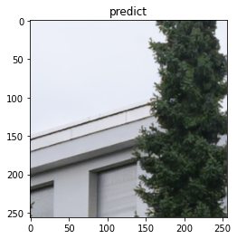 | 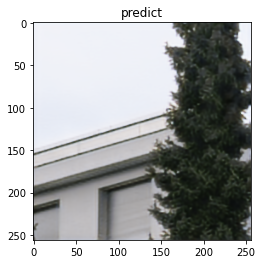 | 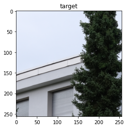 |
| 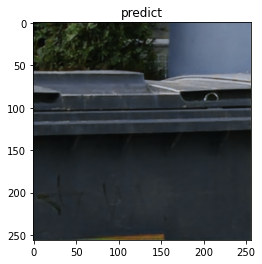 | 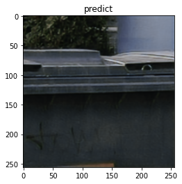 | 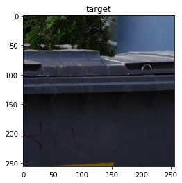 |
| 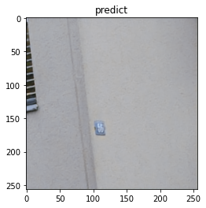 | 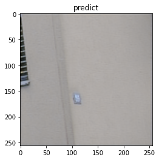 | 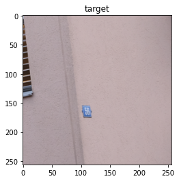 |
| 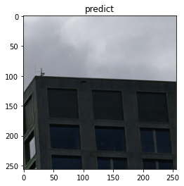 | 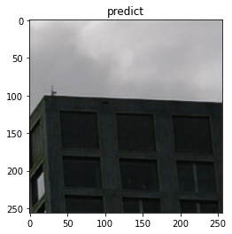 | 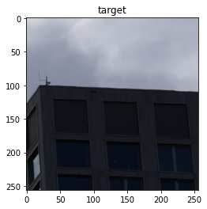 |
| 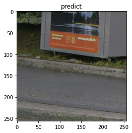 | 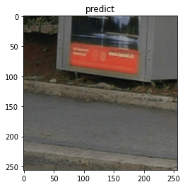 |  |
| 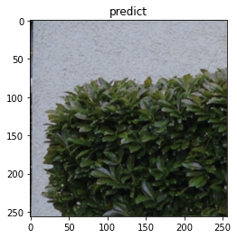 | 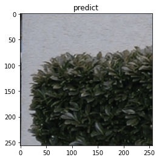 | 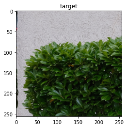 |

- [Zurich -> MAI] Domain adaptation 1 image vs 10

| 10 images                              | 5 images                              | 1 image                               | Ground Trough                          |
| -------------------------------------- | ------------------------------------- | ------------------------------------- | -------------------------------------- |
| 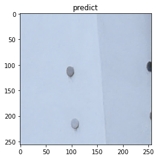 | 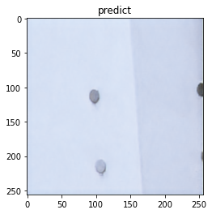 | 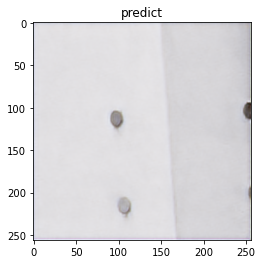 | 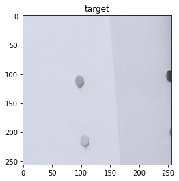 |
| 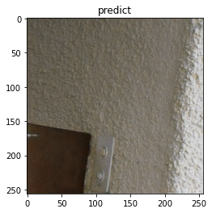 | 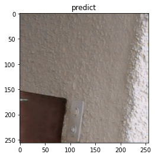 | 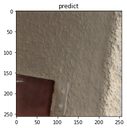 |  |
|  |  | 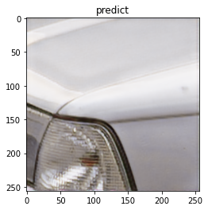 |  |
|  | 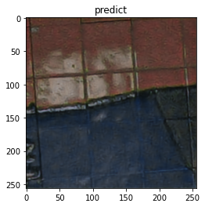 | 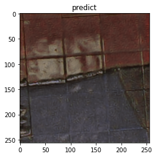 | 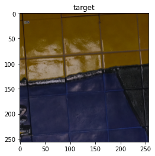 |
|  |  |  |  |
